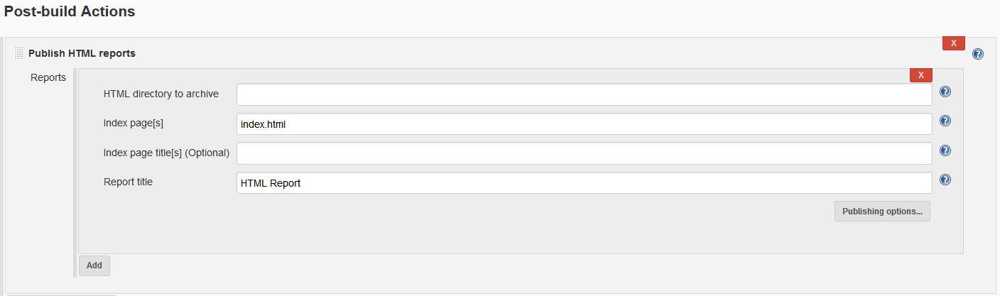
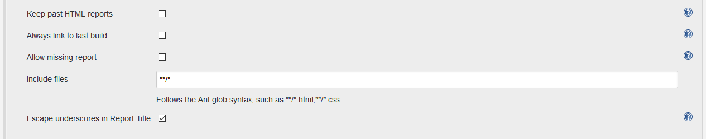

HTML Publisher Plugin
=====================

[](https://gitter.im/jenkinsci/htmlpublisher-plugin?utm_source=badge&utm_medium=badge&utm_campaign=pr-badge&utm_content=badge)
[](https://plugins.jenkins.io/htmlpublisher)
[](https://github.com/jenkinsci/htmlpublisher-plugin/releases/latest)
[](https://plugins.jenkins.io/htmlpublisher)

## About this plugin

The HTML Publisher plugin is useful to publish HTML reports that your build generates to the job and build pages. It is designed to work with both _Freestyle_ projects as well as being used in a Jenkins _Pipeline_.

## Usage

### Installing and enabling the plugin

The HTML Publisher plugin can be installed from any Jenkins installation connected to the Internet using the **Plugin Manage** screen.
Once installed, the plugin can be configured as part of your Jenkins _Freestyle_ job, or used in a Jenkins _Pipeline_.

#### Using with Freestyle Jobs

The HTML Publisher plugin can be configured in the post build portion of your Jenkins job.



* HTML directory to archive - the path to the report directory to archive relative to the workspace.
* Index page[s] - comma-seperated list of files that will be used as index pages. Ant patterns can be used.
* Index page title[s] (Optional) - optional title(s) for the index pages, which will be used as the tab names. If this is not provided, file names will be used instead.
* Report title - the name of the report.

Clicking _Publishing options..._ will present you with some additional options:



* Keep past HTML reports - whether to keep all archived reports or only the one from the last stable build.
* Always link to last build - whether to always link to the last build's report regardless of status or only to link to the last successful build's.
* Allow missing report - if `false`, build will be marked as failed if the report directory does not exist.
* Include files - Optional Ant pattern that specifies what files in the report directory to archive. Defaults to archiving all files in the given report directory.
* Escape underscores in Report Title - if `true`, underscores in report titles will be escaped to `_5F` along with other non-alphanumeric characters. If `false` they will be left as is.

#### Using with Pipeline Jobs

The HTML Publisher plugin can also be used as part of a Jenkins Pipeline. All you need to do is reference the `publishHTML` step in your pipeline. e.g.
```
publishHTML (target : [allowMissing: false,
 alwaysLinkToLastBuild: true,
 keepAll: true,
 reportDir: 'reports',
 reportFiles: 'myreport.html',
 reportName: 'My Reports',
 reportTitles: 'The Report'])
```

See https://jenkins.io/doc/pipeline/steps/htmlpublisher/ for a reference of available step parameters.

#### Troubleshooting

If you are having trouble viewing the published HTML reports, check your browser console to see if there are any errors about Content Security Policy. This is often a culprit. If see errors, review https://wiki.jenkins.io/display/JENKINS/Configuring+Content+Security+Policy for instructions on how to resolve.

